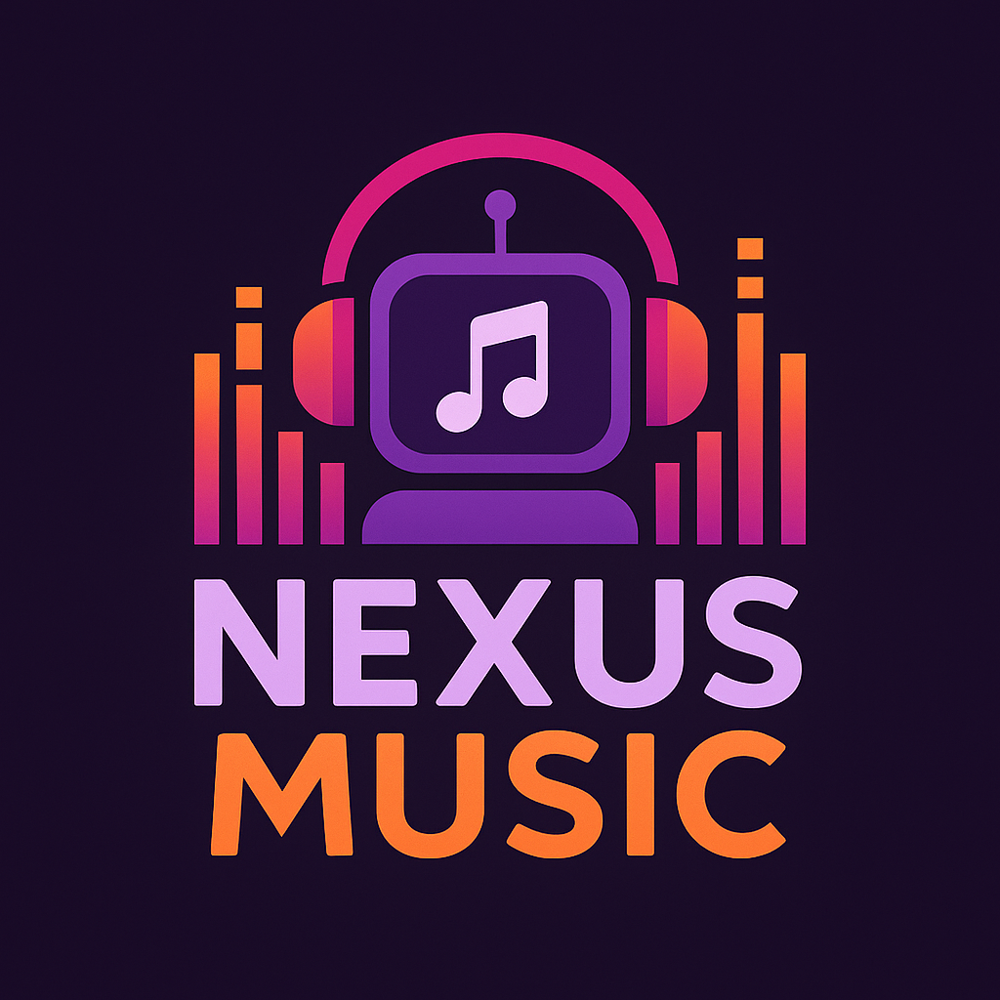

# 🎵 Nexus Music

<div align="center">
  
  
  ### O bot de música mais avançado para Discord

  [](https://nodejs.org/)
  [](https://developer.mozilla.org/en-US/docs/Web/JavaScript)
  
</div>

---

## 📋 Índice

- [✨ Sobre o Projeto](#-sobre-o-projeto)
- [🎯 Funcionalidades](#-funcionalidades)
- [🚀 Tecnologias Utilizadas](#-tecnologias-utilizadas)
- [📁 Estrutura do Projeto](#-estrutura-do-projeto)
- [⚙️ Instalação](#️-instalação)
- [🎮 Comandos](#-comandos)
- [🌐 Website](#-website)
- [🎨 Logo e Identidade Visual](#-logo-e-identidade-visual)
- [📊 Estatísticas](#-estatísticas)
- [🤝 Contribuindo](#-contribuindo)
- [📄 Licença](#-licença)
- [👨‍💻 Autor](#-autor)

---

## ✨ Sobre o Projeto

O **Nexus Music** é um bot de música avançado para Discord desenvolvido com foco na qualidade de áudio e experiência do usuário. Este projeto open source oferece suporte a múltiplas plataformas de streaming, interface intuitiva e recursos exclusivos, sendo ideal para estudo, desenvolvimento e implementação de bots de música no Discord.

### 🎵 Principais Características

- **Alta Qualidade de Áudio**: Reprodução em qualidade HD
- **Múltiplas Plataformas**: YouTube e Spotify
- **Interface Intuitiva**: Controles fáceis de usar
- **Recursos Avançados**: Filtros de áudio, letras sincronizadas, histórico
- **Estabilidade**: Sistema robusto e confiável

---

## 🎯 Funcionalidades

### 🎼 Comandos de Música
- **Reprodução**: `n!play` - Reproduz músicas de qualquer plataforma
- **Controle**: `n!pause`, `n!resume`, `n!stop` - Controles básicos
- **Navegação**: `n!skip`, `n!back`, `n!jump` - Navegação na fila
- **Fila**: `n!queue`, `n!clear`, `n!shuffle` - Gerenciamento da fila
- **Volume**: `n!volume` - Controle de volume
- **Filtros**: `n!filter` - Aplicar filtros de áudio
- **Letras**: `n!lyrics` - Exibir letras sincronizadas

### 🛠️ Comandos Utilitários
- **Ajuda**: `n!ajuda` - Lista de comandos disponíveis
- **Status**: `n!status` - Informações do bot
- **Ping**: `n!ping` - Latência do bot
- **Adicionar**: `n!adicionar` - Link para convidar o bot

### 🎛️ Recursos Avançados
- **Sistema de Loop**: Loop de música, fila e desativado
- **Histórico**: Histórico de músicas reproduzidas
- **Salvar Músicas**: Salvar músicas favoritas
- **Filtros de Áudio**: Bassboost, nightcore, vaporwave e mais
- **Letras Sincronizadas**: Letras em tempo real
- **Controle por Botões**: Interface com botões interativos

---

## 🚀 Tecnologias Utilizadas

### Backend
- **Node.js** - Runtime JavaScript
- **Discord.js** - API do Discord
- **Discord Player** - Sistema de reprodução de áudio
- **Play-dl** - Extrator de mídia
- **Express** - Servidor web
- **FFmpeg** - Processamento de áudio

### Frontend (Website)
- **HTML5** - Estrutura
- **CSS3** - Estilização
- **JavaScript** - Interatividade
- **Font Awesome** - Ícones
- **Google Fonts** - Tipografia

### Plataformas Suportadas
- **YouTube** - Vídeos e playlists
- **Spotify** - Músicas e playlists
---

## 📁 Estrutura do Projeto

```
Nexus Music/
├── Bot/                    # Código do bot Discord
│   ├── commands/          # Comandos do bot
│   │   ├── core/         # Comandos básicos
│   │   └── music/        # Comandos de música
│   ├── buttons/          # Botões interativos
│   ├── events/           # Eventos do Discord
│   ├── config.js         # Configurações
│   ├── main.js           # Arquivo principal
│   └── package.json      # Dependências
├── Site/                  # Website do projeto
│   ├── index.html        # Página inicial
│   ├── comandos.html     # Lista de comandos
│   ├── recursos.html     # Recursos disponíveis
│   ├── adicionar.html    # Página de convite
│   ├── style.css         # Estilos
│   └── script.js         # JavaScript
└── Logos/                 # Assets visuais
    ├── Logo.png          # Logo principal
    ├── Logo Bg.png       # Logo com fundo
    └── Banner.png        # Banner promocional
```

---

## ⚙️ Instalação

### Pré-requisitos
- Node.js 18.x ou superior
- FFmpeg instalado
- Conta de desenvolvedor Discord

### Passos para Instalação

1. **Clone o repositório**
   ```bash
   git clone https://github.com/jvwp7/nexus-music.git
   cd nexus-music/Bot
   ```

2. **Instale as dependências**
   ```bash
   npm install
   ```

3. **Configure as variáveis de ambiente**
   ```bash
   # Crie um arquivo .env
   DISCORD_TOKEN=seu_token_aqui
   GUILD_ID=id_do_seu_servidor
   ```

4. **Execute o bot**
   ```bash
   npm start
   ```

### Configuração do Bot Discord

1. Acesse o [Portal de Desenvolvedores do Discord](https://discord.com/developers/applications)
2. Crie uma nova aplicação
3. Vá para a seção "Bot" e crie um bot
4. Copie o token e adicione ao arquivo `.env`
5. Configure as permissões necessárias:
   - Send Messages
   - Use Slash Commands
   - Connect
   - Speak
   - Use Voice Activity

> **⚠️ Importante**: Este é um projeto educacional. Para usar em produção, certifique-se de configurar adequadamente as variáveis de ambiente e seguir as melhores práticas de segurança.

---

## 🎮 Comandos

### Comandos de Música

| Comando | Descrição | Exemplo |
|---------|-----------|---------|
| `n!play` | Reproduz uma música | `n!play despacito` |
| `n!pause` | Pausa a reprodução | `n!pause` |
| `n!resume` | Retoma a reprodução | `n!resume` |
| `n!stop` | Para a reprodução | `n!stop` |
| `n!skip` | Pula para próxima música | `n!skip` |
| `n!back` | Volta para música anterior | `n!back` |
| `n!queue` | Mostra a fila de músicas | `n!queue` |
| `n!volume` | Ajusta o volume | `n!volume 50` |
| `n!filter` | Aplica filtros de áudio | `n!filter bassboost` |
| `n!lyrics` | Mostra letras da música | `n!lyrics` |

### Comandos Utilitários

| Comando | Descrição | Exemplo |
|---------|-----------|---------|
| `n!ajuda` | Lista todos os comandos | `n!ajuda` |
| `n!status` | Informações do bot | `n!status` |
| `n!ping` | Latência do bot | `n!ping` |
| `n!adicionar` | Link para convidar o bot | `n!adicionar` |

---

## 🌐 Website

O projeto inclui um website moderno e responsivo desenvolvido com HTML5, CSS3 e JavaScript, servindo como demonstração das capacidades do bot e documentação para desenvolvedores.

### 📱 Características do Website

- **Design Responsivo**: Adaptável a todos os dispositivos
- **Interface Moderna**: Design limpo e profissional
- **Navegação Intuitiva**: Menu de navegação fácil de usar
- **Seções Informativas**: 
  - Página inicial com apresentação
  - Lista completa de comandos
  - Recursos disponíveis
  - Página de convite do bot

### 🎨 Elementos Visuais

- **Logo Animado**: Logo com animações CSS
- **Gradientes Modernos**: Cores vibrantes e atrativas
- **Ícones Font Awesome**: Ícones profissionais
- **Tipografia Google Fonts**: Fonte Poppins para melhor legibilidade

### 📄 Páginas Disponíveis

- **index.html** - Página inicial com apresentação do bot
- **comandos.html** - Lista completa de comandos
- **recursos.html** - Recursos e funcionalidades
- **adicionar.html** - Página para convidar o bot

---

## 🎨 Logo e Identidade Visual

### 🖼️ Assets Disponíveis

O projeto inclui uma identidade visual completa com:

- **Logo.png** - Logo principal do Nexus Music
- **Logo Bg.png** - Logo com fundo personalizado
- **Banner.png** - Banner promocional

### 🎯 Conceito do Logo

O logo do Nexus Music representa:
- **Robô Musical**: Simboliza a automação e tecnologia
- **Fones de Ouvido**: Representa a experiência musical
- **Equalizador**: Mostra o controle de áudio
- **Cores Vibrantes**: Gradientes modernos e atrativos

### 🎨 Paleta de Cores

- **Azul Principal**: #667eea
- **Roxo Secundário**: #764ba2
- **Branco**: #ffffff
- **Preto**: #000000

---

## 📊 Estatísticas

O bot inclui um sistema de estatísticas que monitora:

- **Servidores**: Número de servidores conectados
- **Usuários**: Total de usuários atendidos
- **Músicas**: Total de músicas reproduzidas
- **Tempo Online**: Tempo de atividade do bot

> **💡 Dica**: O sistema de estatísticas pode ser personalizado conforme suas necessidades específicas.

### 📈 Métricas Disponíveis

- Tempo de atividade
- Comandos executados
- Músicas reproduzidas
- Servidores atendidos
- Usuários únicos

---

## 🤝 Contribuindo

Contribuições são sempre bem-vindas! Este projeto é open source e aceita contribuições da comunidade. Para contribuir:

1. **Fork o projeto**
2. **Crie uma branch para sua feature** (`git checkout -b feature/AmazingFeature`)
3. **Commit suas mudanças** (`git commit -m 'Add some AmazingFeature'`)
4. **Push para a branch** (`git push origin feature/AmazingFeature`)
5. **Abra um Pull Request**

### 🎯 Áreas para Contribuição

- **Novos comandos de música**
- **Melhorias na interface**
- **Otimizações de performance**
- **Correção de bugs**
- **Documentação**
- **Traduções**

### 📋 Diretrizes de Contribuição

- Mantenha o código limpo e bem documentado
- Teste suas mudanças antes de submeter
- Siga as convenções de nomenclatura
- Adicione comentários explicativos quando necessário

---

## 📄 Licença

Este projeto está sob a licença MIT. Veja o arquivo [LICENSE](Bot/LICENSE) para mais detalhes.

---

## 👨‍💻 Autor

**jvwp7** - Desenvolvedor do Nexus Music

- **GitHub**: [@jvwp7](https://github.com/jvwp7)
- **Discord**: jvwp7

### 🎓 Sobre o Projeto

Este projeto foi desenvolvido como uma demonstração de como criar um bot de música completo para Discord usando Node.js e Discord.js. É ideal para desenvolvedores que querem aprender sobre:

- **APIs do Discord**
- **Sistemas de áudio**
- **Desenvolvimento de bots**
- **Interface web responsiva**
- **Integração com plataformas de streaming**

---

<div align="center">
  
  ### ⭐ Se este projeto te ajudou, considere dar uma estrela!
  
  **Nexus Music** - Projeto open source para desenvolvimento de bots de música 🎵
  
</div> 
